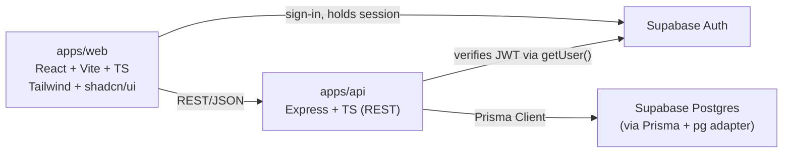
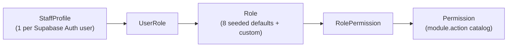

# Architecture

Cleopatra System is a commercial Printing ERP built as an npm-workspaces monorepo. This document describes the system as it exists today (Phase 1 and Phase 2 — Identity & Access Management — complete). It will be extended, not rewritten, as later migration phases add real business logic — see [MIGRATION_PLAN.md](MIGRATION_PLAN.md) for what's still to come and [LEGACY_ANALYSIS.md](LEGACY_ANALYSIS.md) / [LEGACY_MAPPING.md](LEGACY_MAPPING.md) for where each piece comes from.

For the reasoning behind specific choices below, see the [ADR folder](adr/).

---

## 1. System overview



- **`apps/web`** is a single-page React app (React Router since Phase 2 — see [ADR 0024](adr/0024-routing-introduced-phase-2.md)). It talks to `apps/api` over REST/JSON, and talks to **Supabase Auth directly** for sign-in (the browser holds the session; the API never sees a password).
- **`apps/api`** is a REST API. It never talks to Postgres directly with raw SQL — all access goes through Prisma. It verifies incoming requests by validating the Supabase-issued JWT, then loads the caller's application-level roles/permissions from the database (`requireAuth` middleware — see [§6](#6-identity--access-management)).
- **`packages/shared`** holds Zod validation schemas and TypeScript types used by _both_ apps, so a field can't drift between what the frontend sends and what the backend expects. It will also hold the ported calculation engine (Phase 4) — see [§5](#5-the-calculation-engine-phase-4).
- Supabase itself provides both the Postgres database and the Auth service; there is no separate self-hosted auth server.

---

## 2. Monorepo layout

```
Cleopatra_System/
├── apps/
│   ├── web/                 React + Vite + TypeScript frontend
│   │   ├── src/
│   │   │   ├── components/
│   │   │   │   ├── ui/       shadcn/ui vendor components — do not hand-edit business logic in here
│   │   │   │   ├── AppShell.tsx        top nav + logout, wraps every authenticated route
│   │   │   │   └── ProtectedRoute.tsx  client-side route/permission gate (UX only — see §6)
│   │   │   ├── pages/        one folder per screen/feature area (login, dashboard, settings, users, roles, permissions, …)
│   │   │   ├── lib/          fetch wrapper (auto-attaches the Supabase access token), Supabase client, cn() helper
│   │   │   └── state/        AuthContext (session + roles/permissions); future cross-component state (cart store, Phase 5+) lands here too
│   │   └── Dockerfile         multi-stage build → nginx
│   └── api/                 Express + TypeScript REST API
│       ├── src/
│       │   ├── routes/        thin Express routers, one file per resource
│       │   ├── controllers/   request/response handling + Zod validation
│       │   ├── services/      multi-step business logic — authContext.ts (role/permission loading), auditService.ts, userService.ts, and (as needed) e.g. Phase 6 order finalization
│       │   ├── middlewares/    requireAuth (authentication), requirePermission (authorization), error handling
│       │   ├── lib/           Prisma client, Supabase admin client
│       │   ├── config/        environment loading/validation
│       │   ├── utils/         small pure helpers (e.g. Decimal serialization)
│       │   └── generated/prisma/  Prisma Client output — never hand-edit, never commit business logic here
│       ├── prisma/
│       │   ├── schema.prisma
│       │   ├── migrations/
│       │   └── seed.ts
│       └── Dockerfile
├── packages/
│   └── shared/               Zod schemas + shared types, consumed by both apps
│       └── src/
│           ├── schemas/       one file per domain concept (setting.ts, customer.ts, …)
│           └── calc/          calculation engine (Phase 4 — not yet populated)
├── legacy/                    the original system (read-only, never modified — see below)
├── adr/                       Architecture Decision Records
├── docker-compose.yml
└── {ARCHITECTURE,CODING_STANDARDS,CONTRIBUTING,API_CONVENTIONS,LEGACY_ANALYSIS,MIGRATION_PLAN,LEGACY_MAPPING}.md
```

Each app/package has its own `package.json`, `tsconfig.json`, and `eslint.config.js`. The root `package.json` only holds workspace-wide scripts (`build`, `lint`, `typecheck`, `format`) that fan out to each workspace — see its `scripts` block for the exact commands.

---

## 3. Backend request flow

A typical mutating request (e.g. `PUT /api/settings`) flows as:

1. **Route** (`src/routes/settings.ts`) maps an HTTP verb + path to a controller function. Routes contain no logic.
2. **Controller** (`src/controllers/settings.ts`) parses/validates `req.body` against a Zod schema imported from `@cleopatra/shared`, calls Prisma (directly for simple CRUD, or through a `service` for multi-step operations), and shapes the response as an `ApiResponse<T>`.
3. **Prisma** executes the query against Supabase Postgres over the pooled connection (`DATABASE_URL`, port 6543) using the `@prisma/adapter-pg` driver adapter — see [ADR 0004](adr/0004-prisma-orm.md) for why a driver adapter is required at all (Prisma 7 no longer reads `DATABASE_URL` from `schema.prisma` directly).
4. Money fields come back from Prisma as `Decimal` instances; `serializeDecimals()` (`src/utils/serialize.ts`) converts them to plain `number`s before the JSON response is sent, so API consumers never have to know Prisma's internal numeric type.
5. If anything throws — a Zod validation failure, a Prisma error, anything — **Express 5 automatically forwards the rejected promise** to `errorHandler` (`src/middlewares/errorHandler.ts`), which maps `ZodError` to `400` and everything else to `500`, always in the `ApiResponse` error shape. No manual `try/catch` is needed in controllers for this to work.

Migrations run against `DIRECT_URL` (port 5432, session mode) rather than the pooled `DATABASE_URL`, because DDL statements need a non-pooled connection — configured in `prisma.config.ts`, not in `schema.prisma` (Prisma 7 moved connection configuration out of the schema file entirely).

---

## 4. Data model shape

The full schema lives in `apps/api/prisma/schema.prisma` (single source of truth — this document does not duplicate field lists). The shape follows a small number of consistent, repo-wide rules, decided once in Phase 1 and applied everywhere rather than re-litigated per table:

- **UUID primary keys** everywhere (`id String @id @default(uuid()) @db.Uuid`) — [ADR 0006](adr/0006-uuid-primary-keys.md).
- **Soft delete** (`isDeleted`, `deletedAt`, `deletedBy`) on every independently-addressable business entity; plain child/line-item records (e.g. `OrderItem`, `Payment`) are hard-deleted with their parent — [ADR 0007](adr/0007-soft-delete.md).
- **`branchId` is required, not nullable**, on every branch-scoped table, even though only one branch exists today — [ADR 0009](adr/0009-multi-branch-ready-schema.md).
- **Human-readable sequential document numbers** (`Order.invoiceNumber`, `Quotation.quotationNumber`, `WorkOrder.workOrderNumber`) generated from a `DocumentSequence` counter table, never computed by reading "the last number" in application code — [ADR 0008](adr/0008-document-numbering.md).
- **Money is `Decimal`, never `Float`** — floating-point rounding errors are unacceptable in an invoicing system.
- Several tables exist with schema only and no attached business logic yet: `Quotation`/`QuotationItem`, `WorkOrder`, `TreasuryEntry`, `InventoryItem`/`StockLevel`/`StockMovement`, `Attachment`, `AuditLog`. Each has its own ADR explaining why it was created ahead of its implementation phase.

---

## 5. The calculation engine (Phase 4)

Not yet implemented, but architecturally decided: the entire pricing/calculation engine from the legacy system (`resolveTieredCalc`, `calculateNumberingSheets`, `computeBoards`, and the five per-product calculators) will be ported **verbatim** as pure, side-effect-free TypeScript functions in `packages/shared/src/calc/`. "Pure" means: no database access, no HTTP, no React — just `(input, settings) => breakdown`. This is what makes it possible to:

- Unit-test it against golden-master output captured from the legacy file, with zero infrastructure.
- Call it from `apps/api` (the planned, authoritative execution path — see [ADR 0016](adr/0016-calc-engine-verbatim-port.md)) without duplicating the formulas in a second language or location.

No calculation code exists yet in this repository. `legacy/cleopatra_press_system.html` remains the only working implementation until Phase 4 lands and passes its regression suite.

---

## 6. Identity & Access Management

Two cleanly separated layers, deliberately not conflated ([ADR 0021](adr/0021-authn-authz-layering.md)):

**Authentication — who is this?** — entirely delegated to **Supabase Auth**. `apps/web` calls Supabase's client SDK directly for sign-in; the resulting JWT is attached to every request to `apps/api` as `Authorization: Bearer <token>`. `apps/api` never stores, sees, or hashes a password itself — Supabase owns the credential end to end, including password reset (self-service reset calls Supabase directly from the browser; admin-triggered reset uses the Supabase Admin API server-side).

**Authorization — what can they do here?** — a true, database-driven RBAC system that has nothing to do with Supabase ([ADR 0022](adr/0022-database-driven-rbac.md)):



- `StaffProfile` is the application-level identity record — name, email, phone, `isActive`, `lastLoginAt`, home `branchId` — linked 1:1 to a Supabase Auth user via `supabaseUserId`.
- A `StaffProfile` holds one or more `Role`s (`UserRole` join). A `Role` holds a set of `Permission`s (`RolePermission` join). **Nothing about "who can do what" is hardcoded in application code** — `requirePermission('customers.view')` always queries the database (via `loadAuthContext()`, `src/services/authContext.ts`), never an in-code role→permission map.
- Permission keys follow `<module>.<action>` (e.g. `customers.view`), with two wildcard forms: `<module>.*` (everything in one module) and `*` (superuser — granted only to the seeded `SUPER_ADMIN` role). Matching logic lives in `packages/shared/src/permissions.ts` (`hasPermission()`), shared by the backend's authorization check and available to the frontend for UX-only gating.
- The 8 default roles (`SUPER_ADMIN`, `ADMIN`, `SALES`, `CASHIER`, `PRODUCTION_MANAGER`, `DESIGNER`, `PRINTING_OPERATOR`, `VIEWER`) are seeded with sensible default grants (`apps/api/prisma/seed.ts`) but are fully editable from the Role management UI afterward — the seed only establishes a starting point, not a permanent mapping.
- **Branch access**: a user's home branch (`StaffProfile.branchId`) plus any explicit extra grants (`UserBranchAccess`) define `accessibleBranchIds`. `SUPER_ADMIN` bypasses this entirely (`canAccessBranch()`, same service). This is enforced today on the Users resource itself (the one branch-scoped resource that exists so far) and is the pattern every future branch-scoped resource (Orders, Treasury, …) will reuse.
- **Request flow**: `requireAuth` middleware verifies the Supabase JWT, then calls `loadAuthContext(supabaseUserId)` to load the `StaffProfile` + flattened, deduped permission keys + accessible branch ids in one query, attaching it to `req.auth`. `requirePermission(key)` middleware (composed after `requireAuth`) checks `req.auth.permissions` — **the client's own claims about its permissions are never trusted**; every check re-reads what the server loaded from the database on this request.
- **Audit logging**: login, logout, admin-triggered password reset, and user/role/permission changes write to `AuditLog` (`src/services/auditService.ts`) — the first real write-path against the table Phase 1 reserved ([ADR 0013](adr/0013-audit-log-schema-reserved.md), now see [ADR 0025](adr/0025-audit-log-write-path-begins-phase-2.md)).
- **Session management** is Supabase's own JWT/refresh-token mechanism — this system holds no server-side session state. "Remember me" is implemented as a storage adapter switch on the frontend's Supabase client (localStorage vs. sessionStorage, chosen at sign-in) rather than a second client instance — see `apps/web/src/lib/supabase.ts`.
- **Legacy compatibility**: legacy employee records (`{id, name, password, role}` — LEGACY_ANALYSIS §9) have no email field, which the new `StaffProfile`/Supabase Auth model requires, and plaintext passwords cannot and must not be carried forward regardless. A legacy employee maps to a new `StaffProfile` by name (plus an administrator-supplied email) and by role (legacy's undifferentiated `admin`/`staff` maps to `ADMIN`/`VIEWER` as a starting point, to be corrected per person). No import script has been run — Phase 0 confirmed no real legacy data exists to migrate — but the mapping above is what one would use if it ever did.

See [API_CONVENTIONS.md](API_CONVENTIONS.md) for the exact header/status-code/error contract, and [LEGACY_MAPPING.md](LEGACY_MAPPING.md) for how this replaces legacy's plaintext-password, unprotected Settings screen employee list.

---

## 7. Environment & configuration

Each app owns its own `.env` (never committed — see `.gitignore`), documented by a matching `.env.example`:

- `apps/api/.env` — `DATABASE_URL` (pooled, port 6543), `DIRECT_URL` (session, port 5432), `SUPABASE_URL`/`SUPABASE_ANON_KEY`/`SUPABASE_SERVICE_ROLE_KEY`, `PORT`, `CORS_ORIGIN`, `NODE_ENV`.
- `apps/web/.env` — `VITE_SUPABASE_URL`, `VITE_SUPABASE_ANON_KEY`, `VITE_API_URL`.
- `apps/api/src/config/env.ts` validates `process.env` against a Zod schema at startup and fails fast on a malformed config, rather than surfacing a confusing error deep inside a request handler later.

---

## 8. Deployment shape

Both apps have a multi-stage `Dockerfile`; `docker-compose.yml` at the repo root builds and runs both together (`api` on port 4000, `web` served by nginx on port 8080), with environment variables passed through from the host. Database migrations are **not** run automatically by the container — they are an explicit, reviewed step (`npm run prisma:migrate --workspace=apps/api`) run against the target Supabase project before a new version goes live. This has not yet been exercised end-to-end with real Docker builds in this environment (Docker was not installed during initial scaffolding); the Dockerfiles are written and reviewed but not yet build-tested.

---

## 9. What's deliberately not here yet

To avoid this document going stale the moment Phase 3 starts, it does **not** describe: the order-builder/cart architecture (Phase 5), the calculation engine's internals (Phase 4, see §5), or any printing/PDF architecture (Phase 14). Each of those gets documented — and this file updated — when its phase is implemented, per the process in [CONTRIBUTING.md](CONTRIBUTING.md).

Routing (React Router) was introduced ahead of its originally-planned phase because Identity & Access Management's scope — login, protected routes, multiple management screens — genuinely required real navigation; see [ADR 0024](adr/0024-routing-introduced-phase-2.md) for why this was a deliberate, documented deviation rather than silent scope creep.
