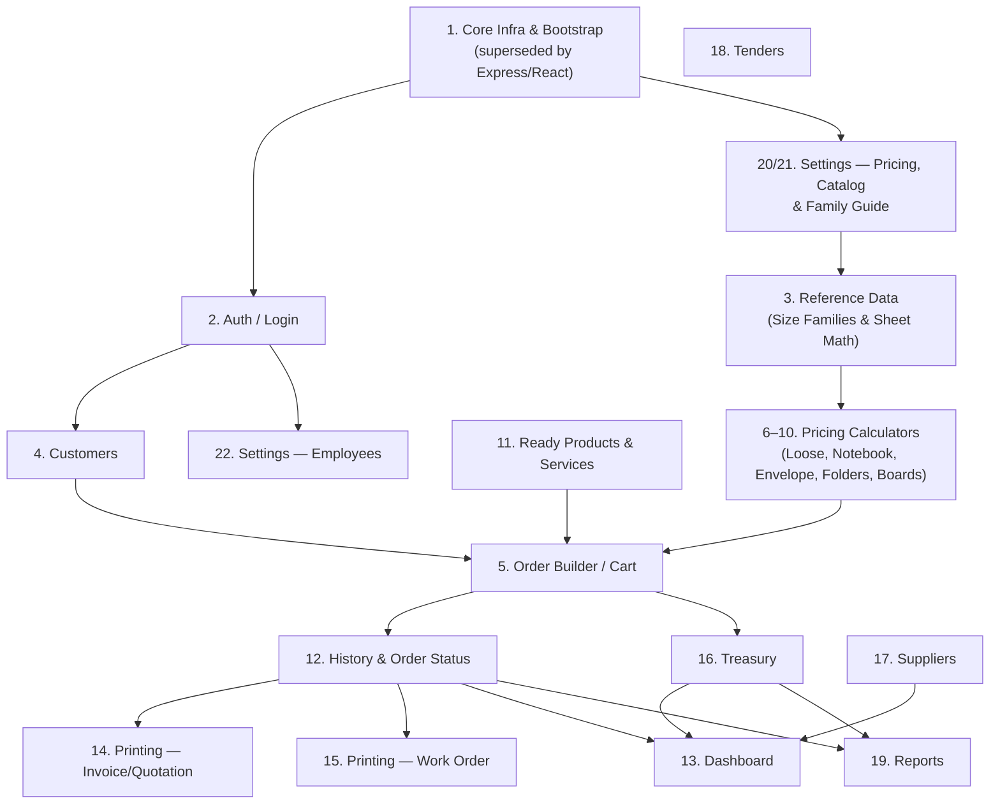

# Legacy Function Mapping — Phase 1.6

**Source of truth:** `legacy/cleopatra_press_system.html` (unmodified, read-only). This document catalogs every function in that file that carries business meaning — calculation, persistence, printing, or screen composition — and maps each one onto the target architecture already established in [MIGRATION_PLAN.md](MIGRATION_PLAN.md) and audited in [LEGACY_ANALYSIS.md](LEGACY_ANALYSIS.md).

**Scope note on "every important function":** the legacy file also contains ~25 one-line UI-state setters with no business meaning at all (e.g. `cpToggleVat`, `cpTreasurySearch`, `cpCbSet` — they only flip a local flag or store a filter string, then call `render()`). These are listed in each module's table for completeness, but their "target" is simply local React component state (`useState`), not a backend service or a database table — calling that out explicitly is more honest than inventing a fictitious backend mapping for a checkbox toggle.

**No business logic has been migrated in this phase.** This is a planning document only.

---

## How to read the tables

Each row: **Function** · **Purpose** · **Dependencies** (other functions / `STATE` fields it reads or calls) · **Calc** (which calculation engine function it relies on, if any) · **Storage** (which legacy `cp_*` storage key it reads/writes, if any) · **Printing** (which print document it triggers, if any) · **Target service** (backend file per MIGRATION_PLAN) · **Target component** (frontend file per MIGRATION_PLAN) · **Target tables** (Prisma models, all already created in Phase 1) · **Priority** (the MIGRATION_PLAN phase that owns this function, plus Critical/High/Medium/Low for how load-bearing it is within that phase).

Legacy storage keys, for reference: `cp_employees`, `cp_clients`, `cp_settings`, `cp_orders`, `cp_treasury`, `cp_suppliers`, `cp_tenders`.

---

## 1. Core Infrastructure & Bootstrap

Nothing here is business logic — it's the render loop, storage plumbing, and generic helpers everything else depends on. Already superseded by the real architecture (Express + React), but every later module implicitly depends on the _concepts_ these implement.

| Function                  | Purpose                                                                                                          | Dependencies                                                                    | Calc                              | Storage                    | Printing                            | Target service                                                               | Target component                                                                      | Target tables | Priority                                        |
| ------------------------- | ---------------------------------------------------------------------------------------------------------------- | ------------------------------------------------------------------------------- | --------------------------------- | -------------------------- | ----------------------------------- | ---------------------------------------------------------------------------- | ------------------------------------------------------------------------------------- | ------------- | ----------------------------------------------- |
| `boot()`                  | App startup: loads all 7 storage collections, applies safe migrations to settings, calls `render()`              | `storeGet`, `DEFAULT_SETTINGS`, `DEFAULT_FAMILIES`                              | —                                 | all keys                   | —                                   | N/A — replaced by Express app bootstrap (`src/index.ts`) + Prisma connection | N/A — replaced by React app mount (`main.tsx`)                                        | —             | Phase 1 · Done (superseded)                     |
| `storeGet(key, fallback)` | Reads one JSON blob from `window.storage`, silently falls back on error                                          | `window.storage.get`                                                            | —                                 | any key                    | —                                   | Prisma `findMany`/`findFirst` per model                                      | —                                                                                     | all           | Phase 1 · Done (superseded)                     |
| `storeSet(key, val)`      | Writes one JSON blob to `window.storage`, whole-collection overwrite                                             | `window.storage.set`                                                            | —                                 | any key                    | —                                   | Prisma `create`/`update`/`upsert` per model                                  | —                                                                                     | all           | Phase 1 · Done (superseded)                     |
| `render()`                | Rebuilds the entire screen's HTML string and replaces `#cpRoot.innerHTML`                                        | `screenBody`, `topbar`, `cartBarHTML`, `STATE.screen`                           | —                                 | —                          | —                                   | N/A                                                                          | N/A — React's own render cycle replaces this entirely                                 | —             | N/A (architectural, not ported)                 |
| `screenBody()`            | Switch statement dispatching to the current screen's render function                                             | `STATE.screen`, every `screenX()` function                                      | —                                 | —                          | —                                   | N/A                                                                          | React Router route table (introduced whenever routing is added, Phase 5+)             | —             | Phase 5 · High                                  |
| `back(to, label)`         | Renders a "← back" link                                                                                          | `cpGo`                                                                          | —                                 | —                          | —                                   | —                                                                            | Shared `<BackLink>` component                                                         | —             | Phase 5 · Low                                   |
| `topbar()`                | Renders the header: logo, employee name, theme toggle, home/logout buttons                                       | `logoSrc`, `STATE.employee`, `STATE.theme`, `cpToggleTheme`, `cpGo`, `cpLogout` | —                                 | —                          | —                                   | —                                                                            | `apps/web/src/components/TopBar.tsx`                                                  | —             | Phase 2 · Medium                                |
| `cpGo(screen)`            | Navigation: sets `STATE.screen`, optionally refetches orders for History                                         | `storeGet('cp_orders')`                                                         | —                                 | `cp_orders` (History only) | —                                   | —                                                                            | React Router `navigate()`                                                             | —             | Phase 5 · High                                  |
| `cpToggleTheme()`         | Flips dark/light theme flag                                                                                      | `STATE.theme`                                                                   | —                                 | —                          | —                                   | —                                                                            | Theme context / `useState` (already implemented in scaffold via `[data-theme]`)       | —             | Phase 1 · Done                                  |
| `cpLogout()`              | Clears employee/cart, returns to login                                                                           | `STATE.employee`, `STATE.cart`                                                  | —                                 | —                          | —                                   | Supabase Auth `signOut()`                                                    | Auth context                                                                          | —             | Phase 2 · Medium                                |
| `ceil(n)`                 | Epsilon-adjusted `Math.ceil` — avoids floating-point rounding bugs on exact integer boundaries                   | —                                                                               | used by every calculator          | —                          | —                                   | `packages/shared/src/calc/utils.ts` (ported verbatim)                        | —                                                                                     | —             | Phase 4 · **Critical**                          |
| `fmt(n)`                  | Formats a number as `X,XXX.XX` for display                                                                       | —                                                                               | used everywhere numbers are shown | —                          | —                                   | `packages/shared/src/calc/utils.ts` (ported verbatim)                        | Shared `formatCurrency()` helper                                                      | —             | Phase 4 · High                                  |
| `uid()`                   | Generates a random client-side id                                                                                | —                                                                               | —                                 | —                          | —                                   | N/A — replaced by DB-generated UUIDs (Phase 1, done)                         | —                                                                                     | —             | Phase 1 · Done (superseded)                     |
| `logoSrc()`               | Returns custom logo or falls back to the embedded default                                                        | `STATE.settings.logo`, `DEFAULT_LOGO`                                           | —                                 | `cp_settings`              | used by every print doc             | `settings.ts` controller (`logoUrl` field)                                   | Referenced wherever the logo renders                                                  | `Setting`     | Phase 1 · Done                                  |
| `showToast(msg)`          | Transient bottom toast notification                                                                              | —                                                                               | —                                 | —                          | —                                   | —                                                                            | Toast/notification component (any UI library)                                         | —             | Phase 5 · Low                                   |
| `cpPrintDoc(fullHtml)`    | Injects a hidden iframe, writes a full HTML doc into it, calls `.print()` — the entire legacy printing mechanism | —                                                                               | —                                 | —                          | called by every `cpPrint*` function | —                                                                            | Replaced by Phase 14's print rendering approach (print-friendly routes or server PDF) | —             | Phase 14 · **Critical** (architecture decision) |

---

## 2. Auth / Login

| Function        | Purpose                                                                 | Dependencies                                     | Calc | Storage        | Printing | Target service                     | Target component                         | Target tables  | Priority                                                       |
| --------------- | ----------------------------------------------------------------------- | ------------------------------------------------ | ---- | -------------- | -------- | ---------------------------------- | ---------------------------------------- | -------------- | -------------------------------------------------------------- |
| `screenLogin()` | Renders employee dropdown + password field                              | `STATE.employees`, `STATE.loginError`, `logoSrc` | —    | `cp_employees` | —        | Supabase Auth (sign-in)            | `apps/web/src/pages/login/LoginPage.tsx` | `StaffProfile` | Phase 2 · **Critical**                                         |
| `cpDoLogin()`   | Compares plaintext password client-side; sets `STATE.employee` on match | `STATE.employees`                                | —    | `cp_employees` | —        | Supabase Auth `signInWithPassword` | `LoginPage.tsx`                          | `StaffProfile` | Phase 2 · **Critical** (security-relevant rewrite, not a port) |

---

## 3. Reference Data — Size Families & Sheet Math

This is the data layer the pricing engine (§6) sits on top of. Already schema'd in Phase 1; the _logic_ functions here (not the HTML-building ones) are ported verbatim in Phase 4.

| Function                                                | Purpose                                                                                                       | Dependencies                                                           | Calc                                   | Storage                   | Printing | Target service                                | Target component                                                          | Target tables                   | Priority                                   |
| ------------------------------------------------------- | ------------------------------------------------------------------------------------------------------------- | ---------------------------------------------------------------------- | -------------------------------------- | ------------------------- | -------- | --------------------------------------------- | ------------------------------------------------------------------------- | ------------------------------- | ------------------------------------------ |
| `getFamilies()`                                         | Returns admin-edited families or the hardcoded defaults                                                       | `STATE.settings.families`, `DEFAULT_FAMILIES`                          | —                                      | `cp_settings`             | —        | `sizeFamilies.ts` controller (done, Phase 1)  | —                                                                         | `SizeFamily`, `SizeFamilyEntry` | Phase 1 · Done                             |
| `famCount(familyKey, label)`                            | Looks up pieces-per-sheet for a given size                                                                    | `getFamilies`                                                          | used by every calculator               | —                         | —        | `packages/shared/src/calc/sizeFamilies.ts`    | —                                                                         | —                               | Phase 4 · **Critical**                     |
| `parseSize(label)`                                      | Parses `"25×35"` into a numeric area                                                                          | —                                                                      | used by `resolveTieredCalc`, numbering | —                         | —        | `packages/shared/src/calc/sizeFamilies.ts`    | —                                                                         | —                               | Phase 4 · **Critical**                     |
| `resolveTieredCalc(groupId, realLabel, qty, threshold)` | **Core pricing rule**: picks the internal calculation sheet size based on quantity vs. threshold              | `GROUPS`, `famCount`, `parseSize`                                      | itself is the calc                     | —                         | —        | `packages/shared/src/calc/tieredCalc.ts`      | —                                                                         | —                               | Phase 4 · **Critical**                     |
| `numberingArea(label)`                                  | Parses size for numbering-specific area comparison                                                            | —                                                                      | used by `calculateNumberingSheets`     | —                         | —        | `packages/shared/src/calc/numbering.ts`       | —                                                                         | —                               | Phase 4 · **Critical**                     |
| `calculateNumberingSheets(groupId, realLabel)`          | **Core pricing rule**: independent numbering-sheet resolution, deliberately separate from `resolveTieredCalc` | `NUMBERING_RULES`, `NUMBERING_GROUP2_MAP`, `numberingArea`, `famCount` | itself is the calc                     | —                         | —        | `packages/shared/src/calc/numbering.ts`       | —                                                                         | —                               | Phase 4 · **Critical**                     |
| `directRepeat(famKey, sizeLabel)`                       | Pieces-per-sheet for "gayer" base (no tiering)                                                                | `getFamilies`                                                          | used by loose/folders calculators      | —                         | —        | `packages/shared/src/calc/sizeFamilies.ts`    | —                                                                         | —                               | Phase 4 · High                             |
| `realSizeOptionsHTML()`                                 | `<option>` list for the tiered "regular" size picker                                                          | `REAL_SIZES`                                                           | —                                      | —                         | —        | —                                             | `<SizeSelect kind="tiered">`                                              | —                               | Phase 5 · Low                              |
| `sizeOptionsForBase(base, selected)`                    | `<optgroup>` list of all sizes for a base sheet                                                               | `getFamilies`                                                          | —                                      | —                         | —        | —                                             | `<SizeSelect kind="byBase">`                                              | —                               | Phase 5 · Low                              |
| `sizeSelectorHTML(base)`                                | Chooses tiered vs. direct size list depending on base                                                         | `sizeOptionsForBase`, `realSizeOptionsHTML`                            | —                                      | —                         | —        | —                                             | `<SizeSelect>`                                                            | —                               | Phase 5 · Low                              |
| `baseSelectHTML(idPrefix, selected)`                    | Renders the "regular vs. gayer" base-sheet dropdown                                                           | —                                                                      | —                                      | —                         | —        | —                                             | `<BaseSheetSelect>`                                                       | —                               | Phase 5 · Low                              |
| `cpBaseChanged(idPrefix)`                               | Repopulates size + paper dropdowns when base sheet changes                                                    | `sizeSelectorHTML`, `paperOptionsFor`                                  | —                                      | —                         | —        | —                                             | Form `onChange` handler (React re-render replaces this DOM-patch pattern) | —                               | Phase 5 · Low                              |
| `designToggleHTML(idPrefix)`                            | "New design / ready design" dropdown                                                                          | —                                                                      | —                                      | —                         | —        | —                                             | `<DesignModeSelect>`                                                      | —                               | Phase 5 · Low                              |
| `numberingToggleHTML(idPrefix)`                         | "Is it numbered?" toggle + start-number field                                                                 | —                                                                      | —                                      | —                         | —        | —                                             | `<NumberingToggle>`                                                       | —                               | Phase 5 · Low                              |
| `cpNumToggle(idPrefix)`                                 | Shows/hides the start-number field                                                                            | —                                                                      | —                                      | —                         | —        | —                                             | Local component state                                                     | —                               | Phase 5 · Low                              |
| `buildDefaultSheetList(prefix)`                         | Builds the 13-name default paper price list                                                                   | `SHEET_TYPE_NAMES`                                                     | —                                      | seeded into `cp_settings` | —        | Already ported into `apps/api/prisma/seed.ts` | —                                                                         | `SheetType`                     | Phase 1 · Done                             |
| `paperOptionsFor(base)`                                 | `<option>` list of paper types for a base sheet                                                               | `STATE.settings.sheetTypes`                                            | —                                      | `cp_settings`             | —        | `sheetTypes.ts` controller (done)             | `<PaperSelect>`                                                           | `SheetType`                     | Phase 1 (data) · Done / Phase 5 (UI) · Low |

---

## 4. Customers / Clients

| Function                  | Purpose                                                         | Dependencies                                 | Calc | Storage              | Printing | Target service                                               | Target component                                 | Target tables       | Priority                                |
| ------------------------- | --------------------------------------------------------------- | -------------------------------------------- | ---- | -------------------- | -------- | ------------------------------------------------------------ | ------------------------------------------------ | ------------------- | --------------------------------------- |
| `screenClients()`         | Renders the client list + add form                              | `STATE.clients`                              | —    | `cp_clients`         | —        | `customers.ts`                                               | `apps/web/src/pages/customers/CustomersPage.tsx` | `Customer`          | Phase 3 · High                          |
| `cpAddClient()`           | Validates + appends a new client                                | `STATE.clients`                              | —    | `cp_clients` (write) | —        | `POST /api/customers`                                        | `CustomersPage.tsx` add form                     | `Customer`          | Phase 3 · High                          |
| `cpDeleteClient(id)`      | Removes a client from the array                                 | `STATE.clients`                              | —    | `cp_clients` (write) | —        | `DELETE /api/customers/:id` (soft delete per Requirement 12) | `CustomersPage.tsx`                              | `Customer`          | Phase 3 · High                          |
| `cpViewClientHistory(id)` | Jumps to History pre-filtered by client                         | `cpGo('history')`, `storeGet('cp_orders')`   | —    | `cp_orders`          | —        | `GET /api/orders?customerId=`                                | `HistoryPage.tsx`                                | `Customer`, `Order` | Phase 9 · Medium                        |
| `clientPickerHTML()`      | Renders the autocomplete input used at the start of every order | `STATE.selectedClient`, `STATE.clientSearch` | —    | —                    | —        | `GET /api/customers?search=`                                 | `apps/web/src/components/CustomerPicker.tsx`     | `Customer`          | Phase 3 · **Critical** (blocks Phase 5) |
| `cpClientSearchLive(v)`   | Live-filters clients as the user types                          | `STATE.clients`                              | —    | —                    | —        | same endpoint, debounced                                     | `CustomerPicker.tsx`                             | `Customer`          | Phase 3 · High                          |
| `cpPickClient(id)`        | Selects a client from the suggestion list                       | `STATE.clients`                              | —    | —                    | —        | —                                                            | `CustomerPicker.tsx`                             | —                   | Phase 3 · High                          |
| `cpQuickAddClient()`      | Inline "add as new client" from the picker                      | `STATE.clients`                              | —    | `cp_clients` (write) | —        | `POST /api/customers`                                        | `CustomerPicker.tsx`                             | `Customer`          | Phase 3 · High                          |

---

## 5. Order Builder / Cart

The shopping-cart/checkout-bar machinery that every product calculator feeds into. This is the highest-traffic UI code in the legacy file.

| Function                                                                                                              | Purpose                                                                                       | Dependencies                                                          | Calc                                      | Storage             | Printing                       | Target service                                                                               | Target component                                                    | Target tables                                                 | Priority                 |
| --------------------------------------------------------------------------------------------------------------------- | --------------------------------------------------------------------------------------------- | --------------------------------------------------------------------- | ----------------------------------------- | ------------------- | ------------------------------ | -------------------------------------------------------------------------------------------- | ------------------------------------------------------------------- | ------------------------------------------------------------- | ------------------------ |
| `screenOrderType()`                                                                                                   | Renders client picker + order-type tabs (offset/digital/boards/services)                      | `clientPickerHTML`, `orderTabContentHTML`                             | —                                         | —                   | —                              | —                                                                                            | `apps/web/src/pages/orders/new/NewOrderPage.tsx`                    | —                                                             | Phase 5 · **Critical**   |
| `orderTabContentHTML(tab)`                                                                                            | Dispatches to the correct sub-tab form                                                        | every product form function                                           | —                                         | —                   | —                              | —                                                                                            | `NewOrderPage.tsx` tab router                                       | —                                                             | Phase 5 · **Critical**   |
| `cpSetServicesSubTab(sub)` / `cpSetOffsetSubTab(sub)` / `cpSetOrderTab(tab)`                                          | Tab-switch state setters (guarded by "client selected?" check)                                | `STATE.selectedClient`                                                | —                                         | —                   | —                              | —                                                                                            | Local component state                                               | —                                                             | Phase 5 · Low            |
| `cpOrderTypeGo(screen)`                                                                                               | Guards navigation on "client selected?"                                                       | `STATE.selectedClient`                                                | —                                         | —                   | —                              | —                                                                                            | Route guard                                                         | —                                                             | Phase 5 · Low            |
| `cpStartOrder()`                                                                                                      | Resets cart/client, navigates to order-type screen                                            | `STATE.cart`, `STATE.selectedClient`                                  | —                                         | —                   | —                              | —                                                                                            | `NewOrderPage.tsx` init                                             | —                                                             | Phase 5 · Medium         |
| `cpCollectionNumbers()`                                                                                               | **Core checkout math**: totals, discount %, 14% VAT, payments, remaining balance              | `STATE.cart`, `STATE.cbDiscount`, `STATE.cbVatOn`, `STATE.cbPayments` | uses each item's pre-computed `breakdown` | —                   | —                              | Ported into `services/orderService.ts` (Phase 6)                                             | `CartBar.tsx` (live preview)                                        | —                                                             | Phase 6 · **Critical**   |
| `cpEnsurePayments()`                                                                                                  | Guarantees at least one payment row exists                                                    | `STATE.cbPayments`                                                    | —                                         | —                   | —                              | —                                                                                            | `CartBar.tsx`                                                       | —                                                             | Phase 5 · Low            |
| `sheetBaseLabel(b)`                                                                                                   | Arabic label for base sheet type                                                              | —                                                                     | —                                         | —                   | —                              | Shared label map (`packages/shared`)                                                         | —                                                                   | —                                                             | Phase 5 · Low            |
| `cpOrderDetailsHTML(item)`                                                                                            | Renders one cart line's customer-facing summary                                               | `kindLabel`                                                           | —                                         | —                   | —                              | —                                                                                            | `CartItemSummary.tsx`                                               | —                                                             | Phase 5 · Medium         |
| `cartBarHTML()`                                                                                                       | Renders the entire sticky checkout bar                                                        | `cpCollectionNumbers`, `cpOrderDetailsHTML`, `cpPaymentsListHTML`     | —                                         | —                   | triggers all `cpPrint*Preview` | —                                                                                            | `apps/web/src/components/CartBar.tsx`                               | —                                                             | Phase 5/6 · **Critical** |
| `cpPaymentsListHTML()`                                                                                                | Renders the split-payment row list                                                            | `STATE.cbPayments`, `PAYMENT_METHODS`                                 | —                                         | —                   | —                              | —                                                                                            | `PaymentsList.tsx`                                                  | `Payment`                                                     | Phase 6 · High           |
| `cpToggleVat()`                                                                                                       | Toggles the 14% VAT checkbox                                                                  | `STATE.cbVatOn`                                                       | —                                         | —                   | —                              | —                                                                                            | Local form state                                                    | —                                                             | Phase 5 · Low            |
| `cpAddPaymentRow()` / `cpRemovePaymentRow(idx)` / `cpUpdatePaymentMethod(idx,val)` / `cpUpdatePaymentAmount(idx,val)` | Split-payment row CRUD (in-memory, pre-save)                                                  | `STATE.cbPayments`                                                    | —                                         | —                   | —                              | —                                                                                            | `PaymentsList.tsx`                                                  | —                                                             | Phase 6 · Medium         |
| `cpToggleFinalizeForm()`                                                                                              | Shows/hides delivery date + notes fields                                                      | `STATE.showFinalizeForm`                                              | —                                         | —                   | —                              | —                                                                                            | Local form state                                                    | —                                                             | Phase 5 · Low            |
| `cpCbSet(key,val)`                                                                                                    | Generic setter for delivery date/payment terms/notes                                          | `STATE`                                                               | —                                         | —                   | —                              | —                                                                                            | Form field `onChange`                                               | —                                                             | Phase 5 · Low            |
| `cpCbRecalc()`                                                                                                        | Recomputes totals when discount % changes (DOM-patch, no full re-render)                      | `cpCollectionNumbers`                                                 | —                                         | —                   | —                              | —                                                                                            | Superseded by React state reactivity                                | —                                                             | Phase 5 · Low            |
| `kindLabel(k)`                                                                                                        | Arabic label for a product kind                                                               | —                                                                     | —                                         | —                   | —                              | Shared label map                                                                             | —                                                                   | —                                                             | Phase 4 · Low            |
| `cpRemoveCartItem(idx)`                                                                                               | Removes one line from the cart                                                                | `STATE.cart`                                                          | —                                         | —                   | —                              | —                                                                                            | `CartBar.tsx`                                                       | —                                                             | Phase 5 · Medium         |
| `cpResetCartBarFields()`                                                                                              | Clears checkout-bar fields after save                                                         | `STATE`                                                               | —                                         | —                   | —                              | —                                                                                            | Cart store reset                                                    | —                                                             | Phase 6 · Low            |
| `renderItemResult(...)`                                                                                               | Renders a calculator's cost breakdown + "add to cart" button                                  | `STATE.settings.profitPercent`                                        | reads calc output                         | —                   | —                              | —                                                                                            | Shared `<CalculatorResult>` component (used by all 5 product forms) | —                                                             | Phase 5 · High           |
| `cpAddToCart(kind, modelName, breakdown)`                                                                             | Pushes a computed item into the cart                                                          | `STATE.cart`                                                          | —                                         | —                   | —                              | —                                                                                            | Cart store `addItem()`                                              | —                                                             | Phase 5 · **Critical**   |
| `cpDoFinalize()`                                                                                                      | **Persistence boundary**: builds the invoice object, re-fetches+appends to `cp_orders`, saves | `cpCollectionNumbers`, `storeGet`/`storeSet('cp_orders')`             | —                                         | `cp_orders` (write) | —                              | `POST /api/orders` (Phase 6, with sequential numbering + auto-treasury per Requirements 1/5) | `CartBar.tsx` save action                                           | `Order`, `OrderItem`, `Payment`, `TreasuryEntry`, `WorkOrder` | Phase 6 · **Critical**   |
| `cpSaveOnly()`                                                                                                        | Calls finalize, navigates to History                                                          | `cpDoFinalize`                                                        | —                                         | —                   | —                              | same as above                                                                                | `CartBar.tsx`                                                       | same                                                          | Phase 6 · High           |
| `cpSaveAndPrint()`                                                                                                    | Calls finalize, navigates to History, prints invoice                                          | `cpDoFinalize`, `cpPrintInvoice`                                      | —                                         | —                   | invoice                        | same as above                                                                                | `CartBar.tsx`                                                       | same                                                          | Phase 6 · High           |

---

## 6. Pricing Calculators — Loose Paper

| Function          | Purpose                                                                                    | Dependencies                                                                                       | Calc                                 | Storage | Printing | Target service                           | Target component                                         | Target tables                           | Priority               |
| ----------------- | ------------------------------------------------------------------------------------------ | -------------------------------------------------------------------------------------------------- | ------------------------------------ | ------- | -------- | ---------------------------------------- | -------------------------------------------------------- | --------------------------------------- | ---------------------- |
| `screenLoose()`   | Screen wrapper for the loose-paper form                                                    | `looseFormHTML`                                                                                    | —                                    | —       | —        | —                                        | `apps/web/src/pages/orders/new/LoosePaperForm.tsx`       | —                                       | Phase 5 · High         |
| `looseFormHTML()` | Renders all loose-paper input fields                                                       | `baseSelectHTML`, `sizeSelectorHTML`, `paperOptionsFor`, `designToggleHTML`, `numberingToggleHTML` | —                                    | —       | —        | —                                        | `LoosePaperForm.tsx`                                     | —                                       | Phase 5 · High         |
| `cpCalcLoose()`   | **Calculator**: sheets needed, plate cost, print runs, numbering, design fee → `breakdown` | `resolveTieredCalc`, `directRepeat`, `calculateNumberingSheets`, `ceil`                            | primary consumer of §3's calc engine | —       | —        | `packages/shared/src/calc/loosePaper.ts` | `LoosePaperForm.tsx` (calls `POST /api/calculate/loose`) | — (produces `OrderItem.breakdown` JSON) | Phase 4 · **Critical** |

## 7. Pricing Calculators — Notebooks

| Function             | Purpose                                                                               | Dependencies                                                                                          | Calc                                 | Storage | Printing | Target service                         | Target component   | Target tables | Priority               |
| -------------------- | ------------------------------------------------------------------------------------- | ----------------------------------------------------------------------------------------------------- | ------------------------------------ | ------- | -------- | -------------------------------------- | ------------------ | ------------- | ---------------------- |
| `screenNotebook()`   | Screen wrapper                                                                        | `notebookFormHTML`                                                                                    | —                                    | —       | —        | —                                      | `NotebookForm.tsx` | —             | Phase 5 · High         |
| `notebookFormHTML()` | Renders notebook input fields (content type, binding, numbering)                      | `realSizeOptionsHTML`, `baseSelectHTML`, `paperOptionsFor`, `designToggleHTML`, `numberingToggleHTML` | —                                    | —       | —        | —                                      | `NotebookForm.tsx` | —             | Phase 5 · High         |
| `cpNbTypeChange()`   | Shows/hides the "copies" field for carbon-copy notebooks                              | —                                                                                                     | —                                    | —       | —        | —                                      | Local form state   | —             | Phase 5 · Low          |
| `cpCalcNotebook()`   | **Calculator**: sheets-per-notebook, print/numbering runs, binding cost → `breakdown` | `resolveTieredCalc`, `calculateNumberingSheets`, `ceil`                                               | primary consumer of §3's calc engine | —       | —        | `packages/shared/src/calc/notebook.ts` | `NotebookForm.tsx` | —             | Phase 4 · **Critical** |

## 8. Pricing Calculators — Envelopes

| Function             | Purpose                                                                                    | Dependencies       | Calc                                       | Storage | Printing | Target service                         | Target component   | Target tables | Priority         |
| -------------------- | ------------------------------------------------------------------------------------------ | ------------------ | ------------------------------------------ | ------- | -------- | -------------------------------------- | ------------------ | ------------- | ---------------- |
| `screenEnvelope()`   | Screen wrapper                                                                             | `envelopeFormHTML` | —                                          | —       | —        | —                                      | `EnvelopeForm.tsx` | —             | Phase 5 · Medium |
| `envelopeFormHTML()` | Renders envelope input fields                                                              | `designToggleHTML` | —                                          | —       | —        | —                                      | `EnvelopeForm.tsx` | —             | Phase 5 · Medium |
| `cpCalcEnvelope()`   | **Calculator**: simplest calculator — plate, print runs, blank-envelope cost → `breakdown` | `ceil`             | uses generic run-based pricing, no tiering | —       | —        | `packages/shared/src/calc/envelope.ts` | `EnvelopeForm.tsx` | —             | Phase 4 · High   |

## 9. Pricing Calculators — Folders

| Function            | Purpose                                                                                               | Dependencies                                                                | Calc                                 | Storage | Printing | Target service                        | Target component  | Target tables | Priority               |
| ------------------- | ----------------------------------------------------------------------------------------------------- | --------------------------------------------------------------------------- | ------------------------------------ | ------- | -------- | ------------------------------------- | ----------------- | ------------- | ---------------------- |
| `screenFolders()`   | Screen wrapper                                                                                        | `foldersFormHTML`                                                           | —                                    | —       | —        | —                                     | `FoldersForm.tsx` | —             | Phase 5 · Medium       |
| `foldersFormHTML()` | Renders folder input fields + optional finishing stages                                               | `baseSelectHTML`, `sizeSelectorHTML`, `paperOptionsFor`, `designToggleHTML` | —                                    | —       | —        | —                                     | `FoldersForm.tsx` | —             | Phase 5 · Medium       |
| `cpCalcFolders()`   | **Calculator**: sheets/print/design + optional riza/sello/jarab/forma/taksir line items → `breakdown` | `resolveTieredCalc`, `directRepeat`, `ceil`                                 | primary consumer of §3's calc engine | —       | —        | `packages/shared/src/calc/folders.ts` | `FoldersForm.tsx` | —             | Phase 4 · **Critical** |

## 10. Pricing Calculators — Boards & Banners

Fully independent m²/linear-meter engine, explicitly unrelated to the offset calculators above.

| Function                             | Purpose                                                                                                      | Dependencies                              | Calc                    | Storage | Printing | Target service                       | Target component                                      | Target tables | Priority               |
| ------------------------------------ | ------------------------------------------------------------------------------------------------------------ | ----------------------------------------- | ----------------------- | ------- | -------- | ------------------------------------ | ----------------------------------------------------- | ------------- | ---------------------- |
| `boardsUnitPrice(category, S, opts)` | Looks up the correct settings-driven unit price per material/design/sellophane combo                         | `STATE.settings`                          | used by `computeBoards` | —       | —        | `packages/shared/src/calc/boards.ts` | —                                                     | —             | Phase 4 · High         |
| `boardsStages(category, selloOn)`    | Builds the production-stage badge list                                                                       | —                                         | —                       | —       | —        | `packages/shared/src/calc/boards.ts` | —                                                     | —             | Phase 4 · Low          |
| `computeBoards(input, S)`            | **Calculator**: per-linear-meter nesting math (print-and-cut) or per-m² math (everything else) → `breakdown` | `boardsUnitPrice`, `boardsStages`, `ceil` | itself is the calc      | —       | —        | `packages/shared/src/calc/boards.ts` | `BoardsForm.tsx` (calls `POST /api/calculate/boards`) | —             | Phase 4 · **Critical** |
| `screenBoards()`                     | Screen wrapper                                                                                               | `boardsFormHTML`                          | —                       | —       | —        | —                                    | `BoardsForm.tsx`                                      | —             | Phase 5 · Medium       |
| `boardsFormHTML()`                   | Renders material/design/sellophane/size fields, toggling print-and-cut vs. normal layout                     | —                                         | —                       | —       | —        | —                                    | `BoardsForm.tsx`                                      | —             | Phase 5 · Medium       |
| `cpBoardsMaterialChange()`           | Shows/hides fields based on selected material                                                                | `BOARDS_MATERIALS`                        | —                       | —       | —        | —                                    | Local form state                                      | —             | Phase 5 · Low          |
| `cpCalcBoards()`                     | Reads form, calls `computeBoards`, renders result                                                            | `computeBoards`                           | —                       | —       | —        | —                                    | `BoardsForm.tsx`                                      | —             | Phase 4/5 · High       |

## 11. Ready Products & Services

| Function                    | Purpose                                   | Dependencies                   | Calc              | Storage       | Printing | Target service                                                                    | Target component       | Target tables  | Priority      |
| --------------------------- | ----------------------------------------- | ------------------------------ | ----------------- | ------------- | -------- | --------------------------------------------------------------------------------- | ---------------------- | -------------- | ------------- |
| `readyProductsFormHTML()`   | Renders the ready-product picker          | `STATE.settings.readyProducts` | —                 | `cp_settings` | —        | `readyProducts.ts` (done, Phase 1)                                                | `ReadyProductForm.tsx` | `ReadyProduct` | Phase 5 · Low |
| `cpCalcReadyProduct()`      | Trivial `price × qty` calculator          | —                              | none — no formula | —             | —        | `packages/shared/src/calc/readyProduct.ts` (trivial, may not need its own module) | `ReadyProductForm.tsx` | —              | Phase 4 · Low |
| `serviceFormHTML(category)` | Renders the design/montage service picker | `STATE.settings.services`      | —                 | `cp_settings` | —        | `services.ts` (done, Phase 1)                                                     | `ServiceForm.tsx`      | `Service`      | Phase 5 · Low |
| `cpCalcService(category)`   | Trivial `price × qty` calculator          | —                              | none — no formula | —             | —        | same as above                                                                     | `ServiceForm.tsx`      | —              | Phase 4 · Low |

---

## 12. History & Order Status

| Function                               | Purpose                                                             | Dependencies                                                       | Calc | Storage             | Printing                          | Target service                                                                    | Target component                             | Target tables        | Priority                                                                                                                       |
| -------------------------------------- | ------------------------------------------------------------------- | ------------------------------------------------------------------ | ---- | ------------------- | --------------------------------- | --------------------------------------------------------------------------------- | -------------------------------------------- | -------------------- | ------------------------------------------------------------------------------------------------------------------------------ |
| `screenHistory()`                      | Renders search box + results container                              | —                                                                  | —    | —                   | —                                 | —                                                                                 | `apps/web/src/pages/history/HistoryPage.tsx` | —                    | Phase 9 · High                                                                                                                 |
| `historyInvoicesFiltered()`            | Filters `STATE.orders` by client/search text                        | `STATE.orders`, `STATE.historyClientFilter`, `STATE.historySearch` | —    | `cp_orders`         | —                                 | `GET /api/orders?search=&customerId=` (with pagination, a deliberate improvement) | `HistoryPage.tsx`                            | `Order`              | Phase 9 · High                                                                                                                 |
| `cpRenderHistoryResults()`             | Renders the filtered order list + status dropdown + reprint buttons | `historyInvoicesFiltered`, `kindLabel`                             | —    | —                   | invoice, work order (via buttons) | same as above                                                                     | `HistoryPage.tsx`                            | `Order`, `WorkOrder` | Phase 9 · High                                                                                                                 |
| `cpHistorySearch(v)`                   | Search-box input handler                                            | `STATE.historySearch`                                              | —    | —                   | —                                 | —                                                                                 | Local/query state                            | —                    | Phase 9 · Low                                                                                                                  |
| `cpUpdateOrderStatus(orderId, status)` | Updates an order's status in place                                  | `STATE.orders`                                                     | —    | `cp_orders` (write) | —                                 | `PATCH /api/orders/:id/status`                                                    | `HistoryPage.tsx` status dropdown            | `Order`              | Phase 9 · High (note: legacy's single status list splits into `Order.status` + `WorkOrder.productionStatus` per Requirement 4) |

---

## 13. Dashboard

| Function           | Purpose                                                                              | Dependencies                                                         | Calc | Storage                                    | Printing | Target service                                                    | Target component                                 | Target tables                                    | Priority        |
| ------------------ | ------------------------------------------------------------------------------------ | -------------------------------------------------------------------- | ---- | ------------------------------------------ | -------- | ----------------------------------------------------------------- | ------------------------------------------------ | ------------------------------------------------ | --------------- |
| `dashboardStats()` | Aggregates today/month/total revenue, treasury balance, supplier debt, top 5 clients | `STATE.orders`, `STATE.treasury`, `STATE.suppliers`, `STATE.clients` | —    | `cp_orders`, `cp_treasury`, `cp_suppliers` | —        | `GET /api/dashboard/stats` — moved to server-side SQL aggregation | `apps/web/src/pages/dashboard/DashboardPage.tsx` | `Order`, `TreasuryEntry`, `Supplier`, `Customer` | Phase 13 · High |
| `screenHome()`     | Renders dashboard tiles + top-clients table + quick-nav                              | `dashboardStats`                                                     | —    | —                                          | —        | same as above                                                     | `DashboardPage.tsx`                              | —                                                | Phase 13 · High |

---

## 14. Printing — Invoice & Quotation

| Function                         | Purpose                                                                                  | Dependencies                                   | Calc                           | Storage     | Printing        | Target service                                                     | Target component                       | Target tables                | Priority                                               |
| -------------------------------- | ---------------------------------------------------------------------------------------- | ---------------------------------------------- | ------------------------------ | ----------- | --------------- | ------------------------------------------------------------------ | -------------------------------------- | ---------------------------- | ------------------------------------------------------ |
| `cpInvoiceDocumentHTML(o, opts)` | Builds the full invoice/quotation A4 HTML document (shared template, `isQuotation` flag) | `STATE.clients`, `logoSrc`, `fmt`, `kindLabel` | reads pre-computed totals only | —           | is the printing | `apps/web/src/print/InvoiceDocument.tsx` / `QuotationDocument.tsx` | same                                   | `Order` or `Quotation`       | Phase 14 · **Critical**                                |
| `cpPrintInvoice(orderId)`        | Prints a saved order as an invoice                                                       | `cpInvoiceDocumentHTML`, `cpPrintDoc`          | —                              | `cp_orders` | invoice         | `GET /api/orders/:id/print` (or client-render)                     | `HistoryPage.tsx` reprint button       | `Order`                      | Phase 14 · High                                        |
| `cpPrintQuotationPreview()`      | Prints the _current in-memory cart_ as a quotation — never persisted in legacy           | `cpCollectionNumbers`, `cpInvoiceDocumentHTML` | —                              | —           | quotation       | `POST /api/quotations` (now persisted per Requirement 2)           | `CartBar.tsx` "print quotation" button | `Quotation`, `QuotationItem` | Phase 7 · **Critical** (behavior change: now persists) |

## 15. Printing — Work Order

| Function                     | Purpose                                                                                                                   | Dependencies                                                   | Calc                                  | Storage     | Printing        | Target service                                    | Target component                     | Target tables                     | Priority                                                                |
| ---------------------------- | ------------------------------------------------------------------------------------------------------------------------- | -------------------------------------------------------------- | ------------------------------------- | ----------- | --------------- | ------------------------------------------------- | ------------------------------------ | --------------------------------- | ----------------------------------------------------------------------- |
| `cpWorkOrderDocumentHTML(o)` | Builds the internal production document per item (print sheet, numbering range, ink, binding), plus a third-party QR code | `STATE.clients`, `kindLabel`, external `api.qrserver.com` call | reads pre-computed `breakdown` fields | —           | is the printing | `apps/web/src/print/WorkOrderDocument.tsx`        | same                                 | `WorkOrder`, `Order`, `OrderItem` | Phase 14 · High (QR dependency decision still open, see MIGRATION_PLAN) |
| `cpPrintWorkOrderPreview()`  | Prints a draft work order from the current cart, before saving                                                            | `cpWorkOrderDocumentHTML`, `cpPrintDoc`                        | —                                     | —           | work order      | client-side preview render, no persistence needed | `CartBar.tsx` preview button         | —                                 | Phase 8 · Medium                                                        |
| `cpPrintWorkOrder(orderId)`  | Prints the work order for a saved order                                                                                   | `cpWorkOrderDocumentHTML`, `cpPrintDoc`                        | —                                     | `cp_orders` | work order      | `GET /api/work-orders/:id/print`                  | `HistoryPage.tsx` / work-order queue | `WorkOrder`                       | Phase 8 · High                                                          |

---

## 16. Treasury

| Function                                                                      | Purpose                                                                          | Dependencies                                      | Calc | Storage               | Printing           | Target service                                                                               | Target component                               | Target tables   | Priority          |
| ----------------------------------------------------------------------------- | -------------------------------------------------------------------------------- | ------------------------------------------------- | ---- | --------------------- | ------------------ | -------------------------------------------------------------------------------------------- | ---------------------------------------------- | --------------- | ----------------- |
| `treasuryBalance()`                                                           | Sums income minus expense (transfers counted in neither — flagged open question) | `STATE.treasury`                                  | —    | `cp_treasury`         | —                  | `GET /api/treasury/balance`                                                                  | `TreasuryPage.tsx` balance card                | `TreasuryEntry` | Phase 10 · High   |
| `screenTreasury()`                                                            | Renders balance, add-entry form, filterable ledger table                         | `treasuryBalance`                                 | —    | `cp_treasury`         | —                  | —                                                                                            | `apps/web/src/pages/treasury/TreasuryPage.tsx` | `TreasuryEntry` | Phase 10 · High   |
| `cpAddTreasury()`                                                             | Adds a manual income/expense/transfer entry                                      | `STATE.treasury`                                  | —    | `cp_treasury` (write) | —                  | `POST /api/treasury` (`sourceType` forced to `MANUAL` server-side)                           | `TreasuryPage.tsx` add form                    | `TreasuryEntry` | Phase 10 · High   |
| `cpDeleteTreasury(id)`                                                        | Removes an entry                                                                 | `STATE.treasury`                                  | —    | `cp_treasury` (write) | —                  | `DELETE /api/treasury/:id` — must reject `INVOICE_PAYMENT`-sourced entries per Requirement 5 | `TreasuryPage.tsx`                             | `TreasuryEntry` | Phase 10 · High   |
| `cpTreasurySearch(v)` / `cpTreasuryFilterType(v)` / `cpTreasuryDate(which,v)` | Ledger filter setters                                                            | `STATE`                                           | —    | —                     | —                  | query params on `GET /api/treasury`                                                          | `TreasuryPage.tsx` filters                     | —               | Phase 10 · Low    |
| `cpPrintTreasury()`                                                           | Prints the ledger statement                                                      | `treasuryBalance`, `STATE.treasury`, `cpPrintDoc` | —    | —                     | treasury statement | `apps/web/src/print/TreasuryStatementDocument.tsx`                                           | `TreasuryPage.tsx` print button                | `TreasuryEntry` | Phase 14 · Medium |

---

## 17. Suppliers

| Function                  | Purpose                                                 | Dependencies                         | Calc | Storage                | Printing | Target service                              | Target component                                 | Target tables                                     | Priority          |
| ------------------------- | ------------------------------------------------------- | ------------------------------------ | ---- | ---------------------- | -------- | ------------------------------------------- | ------------------------------------------------ | ------------------------------------------------- | ----------------- |
| `supplierBalance(s)`      | `purchases − payments` for one supplier                 | —                                    | —    | —                      | —        | computed in `GET /api/suppliers/:id/ledger` | `SupplierDetailPage.tsx`                         | `Supplier`, `SupplierPurchase`, `SupplierPayment` | Phase 11 · Medium |
| `screenSuppliers()`       | Renders supplier list + add form + search               | `STATE.suppliers`, `supplierBalance` | —    | `cp_suppliers`         | —        | —                                           | `apps/web/src/pages/suppliers/SuppliersPage.tsx` | `Supplier`                                        | Phase 11 · Medium |
| `cpAddSupplier()`         | Adds a supplier                                         | `STATE.suppliers`                    | —    | `cp_suppliers` (write) | —        | `POST /api/suppliers`                       | `SuppliersPage.tsx`                              | `Supplier`                                        | Phase 11 · Medium |
| `cpDeleteSupplier(id)`    | Removes a supplier                                      | `STATE.suppliers`                    | —    | `cp_suppliers` (write) | —        | `DELETE /api/suppliers/:id`                 | `SuppliersPage.tsx`                              | `Supplier`                                        | Phase 11 · Medium |
| `cpSupplierSearch(v)`     | Search filter                                           | `STATE.supplierSearch`               | —    | —                      | —        | —                                           | `SuppliersPage.tsx`                              | —                                                 | Phase 11 · Low    |
| `cpOpenSupplier(id)`      | Navigates to supplier detail/ledger                     | `STATE.selectedSupplierId`           | —    | —                      | —        | —                                           | `SupplierDetailPage.tsx`                         | —                                                 | Phase 11 · Low    |
| `screenSupplierDetail()`  | Renders purchase/payment forms + running-balance ledger | `supplierBalance`                    | —    | `cp_suppliers`         | —        | `GET /api/suppliers/:id/ledger`             | `SupplierDetailPage.tsx`                         | `Supplier`, `SupplierPurchase`, `SupplierPayment` | Phase 11 · Medium |
| `cpAddSupplierPurchase()` | Records a purchase                                      | `STATE.suppliers`                    | —    | `cp_suppliers` (write) | —        | `POST /api/suppliers/:id/purchases`         | `SupplierDetailPage.tsx`                         | `SupplierPurchase`                                | Phase 11 · Medium |
| `cpAddSupplierPayment()`  | Records a payment                                       | `STATE.suppliers`                    | —    | `cp_suppliers` (write) | —        | `POST /api/suppliers/:id/payments`          | `SupplierDetailPage.tsx`                         | `SupplierPayment`                                 | Phase 11 · Medium |

---

## 18. Tenders

| Function                           | Purpose                        | Dependencies    | Calc | Storage              | Printing | Target service            | Target component                             | Target tables | Priority       |
| ---------------------------------- | ------------------------------ | --------------- | ---- | -------------------- | -------- | ------------------------- | -------------------------------------------- | ------------- | -------------- |
| `screenTenders()`                  | Renders tender list + add form | `STATE.tenders` | —    | `cp_tenders`         | —        | —                         | `apps/web/src/pages/tenders/TendersPage.tsx` | `Tender`      | Phase 12 · Low |
| `cpAddTender()`                    | Adds a tender                  | `STATE.tenders` | —    | `cp_tenders` (write) | —        | `POST /api/tenders`       | `TendersPage.tsx`                            | `Tender`      | Phase 12 · Low |
| `cpUpdateTenderStatus(id, status)` | Updates tender status enum     | `STATE.tenders` | —    | `cp_tenders` (write) | —        | `PATCH /api/tenders/:id`  | `TendersPage.tsx`                            | `Tender`      | Phase 12 · Low |
| `cpDeleteTender(id)`               | Removes a tender               | `STATE.tenders` | —    | `cp_tenders` (write) | —        | `DELETE /api/tenders/:id` | `TendersPage.tsx`                            | `Tender`      | Phase 12 · Low |

---

## 19. Reports

| Function                 | Purpose                                                    | Dependencies                   | Calc                             | Storage     | Printing | Target service                                          | Target component                             | Target tables        | Priority          |
| ------------------------ | ---------------------------------------------------------- | ------------------------------ | -------------------------------- | ----------- | -------- | ------------------------------------------------------- | -------------------------------------------- | -------------------- | ----------------- |
| `screenReports()`        | Renders date filters + revenue/top-client/top-model tables | `STATE.orders`                 | client-side `reduce` aggregation | `cp_orders` | —        | `GET /api/reports?from=&to=` — moved to server-side SQL | `apps/web/src/pages/reports/ReportsPage.tsx` | `Order`, `OrderItem` | Phase 13 · Medium |
| `cpReportsDate(which,v)` | Date-range filter setters                                  | `STATE.reportsFrom/To`         | —                                | —           | —        | query params                                            | `ReportsPage.tsx`                            | —                    | Phase 13 · Low    |
| `cpPrintReport()`        | Prints a minimal summary report                            | `dashboardStats`, `cpPrintDoc` | —                                | —           | report   | `apps/web/src/print/ReportDocument.tsx`                 | `ReportsPage.tsx` print button               | —                    | Phase 14 · Low    |

---

## 20. Settings — Pricing & Catalog

Already implemented (data + API) in Phase 1; UI editor (beyond the current read-only screen) is the remaining piece.

| Function                                                              | Purpose                                                                                                  | Dependencies                           | Calc | Storage                       | Printing                | Target service                                                                | Target component                                                        | Target tables                                                                   | Priority                                        |
| --------------------------------------------------------------------- | -------------------------------------------------------------------------------------------------------- | -------------------------------------- | ---- | ----------------------------- | ----------------------- | ----------------------------------------------------------------------------- | ----------------------------------------------------------------------- | ------------------------------------------------------------------------------- | ----------------------------------------------- |
| `sheetTypeTableRows(base)`                                            | Renders editable rows for one base sheet's paper price list                                              | `STATE.settings.sheetTypes`            | —    | `cp_settings`                 | —                       | `sheetTypes.ts` (done)                                                        | Settings editor table                                                   | `SheetType`                                                                     | Phase 1 (data) · Done / editor UI · Low         |
| `screenSettings()`                                                    | Renders the entire settings screen (logo, prices, boards, catalog, sheet types, family guide, employees) | almost everything else in this section | —    | `cp_settings`, `cp_employees` | —                       | multiple (done, Phase 1)                                                      | `apps/web/src/pages/settings/SettingsPage.tsx` (read-only version done) | `Setting`, `SheetType`, `ReadyProduct`, `Service`, `SizeFamily`, `StaffProfile` | Phase 1 (read) · Done / editor UI · Medium      |
| `cpSetSetting(key,val)`                                               | Generic single-field settings updater                                                                    | `STATE.settings`                       | —    | `cp_settings` (write)         | —                       | `PUT /api/settings` (done)                                                    | Settings editor form field                                              | `Setting`                                                                       | Phase 1 · Done (API); editor UI · Medium        |
| `cpUpdatePaper` / `cpAddPaper` / `cpDeletePaper`                      | CRUD on the _legacy_ (now-unused) `paperTypesGeneral`/`paperTypesFolders` lists                          | `STATE.settings`                       | —    | `cp_settings` (write)         | —                       | Not ported — legacy itself calls these dead code (superseded by `sheetTypes`) | —                                                                       | —                                                                               | **Not migrated** — dead code in legacy          |
| `cpUpdateSheetType` / `cpAddSheetType` / `cpDeleteSheetType`          | CRUD on the active paper price lists                                                                     | `STATE.settings.sheetTypes`            | —    | `cp_settings` (write)         | —                       | `sheetTypes.ts` (done)                                                        | Settings editor table                                                   | `SheetType`                                                                     | Phase 1 · Done (API); editor UI · Medium        |
| `cpUpdateReadyProduct` / `cpAddReadyProduct` / `cpDeleteReadyProduct` | CRUD on ready products                                                                                   | `STATE.settings.readyProducts`         | —    | `cp_settings` (write)         | —                       | `readyProducts.ts` (done)                                                     | Settings editor table                                                   | `ReadyProduct`                                                                  | Phase 1 · Done (API); editor UI · Low           |
| `cpUpdateService` / `cpAddService` / `cpDeleteService`                | CRUD on services                                                                                         | `STATE.settings.services`              | —    | `cp_settings` (write)         | —                       | `services.ts` (done)                                                          | Settings editor table                                                   | `Service`                                                                       | Phase 1 · Done (API); editor UI · Low           |
| `cpUploadLogo(input)`                                                 | Reads a file as base64, stores as `settings.logo`                                                        | `FileReader`                           | —    | `cp_settings` (write)         | affects every print doc | Phase 14 territory — replace base64-in-DB with Supabase Storage upload        | Settings editor logo uploader                                           | `Setting.logoUrl`                                                               | Phase 14 · Medium (storage architecture change) |
| `cpResetLogo()`                                                       | Clears custom logo, falls back to default                                                                | `STATE.settings`                       | —    | `cp_settings` (write)         | —                       | `PUT /api/settings`                                                           | Settings editor                                                         | `Setting`                                                                       | Editor UI · Low                                 |

## 21. Settings — Size Family Guide

| Function                                 | Purpose                                                                                          | Dependencies                        | Calc                        | Storage               | Printing | Target service                                                                                                 | Target component             | Target tables                   | Priority                                                    |
| ---------------------------------------- | ------------------------------------------------------------------------------------------------ | ----------------------------------- | --------------------------- | --------------------- | -------- | -------------------------------------------------------------------------------------------------------------- | ---------------------------- | ------------------------------- | ----------------------------------------------------------- |
| `protectedLabelsFor(familyKey)`          | Computes which sizes are structurally relied on by `GROUPS`/`REAL_SIZES` and must not be deleted | `GROUPS`, `REAL_SIZES`              | reads calc-engine constants | —                     | —        | Must be ported alongside Phase 4 (depends on the same constants)                                               | Settings editor delete-guard | —                               | Phase 4 · High (must ship with the calc engine, not before) |
| `familyGuideCardsHTML()`                 | Renders each size family's editable size table with protection badges                            | `getFamilies`, `protectedLabelsFor` | —                           | `cp_settings`         | —        | `sizeFamilies.ts` (done)                                                                                       | Settings editor              | `SizeFamily`, `SizeFamilyEntry` | Phase 1 (data) · Done; protection logic · Phase 4           |
| `cpUpdateFamilySize` / `cpAddFamilySize` | Edit/add a size within a family                                                                  | `getFamilies`                       | —                           | `cp_settings` (write) | —        | `sizeFamilies.ts` entry endpoints (done)                                                                       | Settings editor              | `SizeFamilyEntry`               | Phase 1 · Done (API); editor UI · Medium                    |
| `cpDeleteFamilySize(fk, i)`              | Deletes a size, blocked if protected                                                             | `protectedLabelsFor`                | reads calc-engine constants | `cp_settings` (write) | —        | `DELETE /api/size-families/:id/entries/:entryId` (done, protection check deferred to Phase 4 per code comment) | Settings editor              | `SizeFamilyEntry`               | Phase 4 · High (protection check)                           |
| `cpAddFamily()`                          | Adds an entirely new size family                                                                 | `getFamilies`                       | —                           | `cp_settings` (write) | —        | `sizeFamilies.ts` (done)                                                                                       | Settings editor              | `SizeFamily`                    | Phase 1 · Done (API); editor UI · Low                       |

## 22. Settings — Employees

| Function                 | Purpose                                            | Dependencies      | Calc | Storage                | Printing | Target service                                              | Target component                         | Target tables  | Priority                                      |
| ------------------------ | -------------------------------------------------- | ----------------- | ---- | ---------------------- | -------- | ----------------------------------------------------------- | ---------------------------------------- | -------------- | --------------------------------------------- |
| `cpUpdateEmp(i,key,val)` | Edits an employee's name/plaintext password        | `STATE.employees` | —    | `cp_employees` (write) | —        | Not ported as-is — Supabase Auth owns credentials (Phase 2) | `apps/web/src/pages/staff/StaffPage.tsx` | `StaffProfile` | Phase 2 · High (security rewrite, not a port) |
| `cpAddEmp()`             | Adds an employee with a default plaintext password | `STATE.employees` | —    | `cp_employees` (write) | —        | `POST /api/staff/invite` (Supabase Auth invite flow)        | `StaffPage.tsx`                          | `StaffProfile` | Phase 2 · High                                |
| `cpDeleteEmp(i)`         | Removes an employee                                | `STATE.employees` | —    | `cp_employees` (write) | —        | `DELETE`/deactivate via Supabase Auth admin API             | `StaffPage.tsx`                          | `StaffProfile` | Phase 2 · High                                |

---

## Dependency Graph — Safest Migration Order

This graph reflects **actual runtime call dependencies in the legacy code** (e.g. every product calculator calls into §3's tiering/numbering functions; the cart bar calls `cpCollectionNumbers`; finalize calls the cart bar's totals math), mapped onto the module numbers above.

### Safest linear order (ties module numbers to MIGRATION_PLAN phases)

1. **Core infra & data foundations** (Modules 1, 3 data, 20 data — done, Phase 1). Nothing above this layer can be built before it exists, and it carries zero business-calculation risk since it's pure schema/CRUD.
2. **Auth** (Module 2 — Phase 2). Every write endpoint from here on needs a `staffId`; blocking dependency for all mutation-capable modules.
3. **Customers** (Module 4 — Phase 3). Required by the order builder, quotations, tenders (optional link), and treasury (customer reference).
4. **Calculation engine** (Modules 3's logic functions + 6–10 + 11 — Phase 4). The single highest-risk module; must be regression-tested against legacy output in isolation, with no UI/persistence dependency, before anything downstream touches it. The `protectedLabelsFor` delete-guard (Module 21) ships with this phase since it shares the same constants.
5. **Order builder / cart** (Module 5 — Phase 5). Depends on 2, 3, 4, 11 all being ready; nothing in the cart can be tested end-to-end until the calculators exist.
6. **Orders & invoices persistence** (part of Module 5, `cpDoFinalize` onward — Phase 6). First point where money actually gets written to a database — depends on 2–5 and on the Treasury/WorkOrder tables already existing (Phase 1).
7. **Quotations** (Module 14's `cpPrintQuotationPreview` — Phase 7) and **Work Orders** (Module 15 — Phase 8) can proceed in parallel once Phase 6 exists, since both are now independent entities that read from (Quotations) or are created alongside (Work Orders) an `Order`.
8. **History & status** (Module 12 — Phase 9). Needs real orders (Phase 6) and work orders (Phase 8) to have anything to list.
9. **Treasury, Suppliers, Tenders** (Modules 16, 17, 18 — Phases 10–12). Structurally independent of each other and of the order-builder chain (legacy comments confirm this explicitly) — can be built in any order or in parallel once Auth (Module 2) exists. Treasury has one soft dependency: its automatic entries only start appearing once Phase 6 ships, but its manual-entry UI has no such dependency.
10. **Dashboard & Reports** (Modules 13, 19 — Phase 13). Pure aggregation over everything above — must come last among the data-producing modules since it reads from Orders, Treasury, and Suppliers simultaneously.
11. **Printing modernization** (Modules 14, 15's document-building functions, 16's statement, 19's report — Phase 14). Can start as a rendering-mechanism spike early (it doesn't need real data to prototype layout), but final sign-off per document type waits on that document's data-producing phase.
12. **Settings editor UI, Employees UI** (Modules 20–22's remaining edit forms). Lowest urgency — the read-only Phase 1 screen already proves the data layer works; building full edit forms can happen opportunistically alongside any later phase without blocking anything else.

**Explicitly not migrated:** `cpUpdatePaper`/`cpAddPaper`/`cpDeletePaper` (Module 20) — these operate on the legacy `paperTypesGeneral`/`paperTypesFolders` arrays, which the legacy code itself already treats as dead/superseded by `sheetTypes` (per its own comments). Carrying them forward would migrate dead code.
